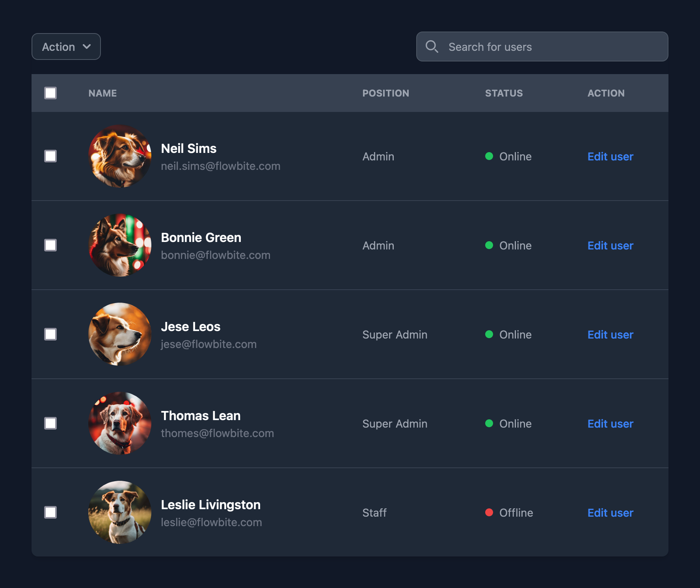

# Dogz

Your one-stop shop for fake avatars - but dogs!


## Introduction

FakerDogz is a lightweight PHP package designed to generate fake dog images that can be used for a variety of purposes, like avatars and other placeholders for web development *paw*poses.

All images are 1024*1024 60% quality JPEGs, resulting in 50-130KB per image.




## Installation

```
composer require bradietilley/faker-dogz
```


## Documentation

It's insanely easy to use. Just run `dogz()` to spawn the Dogz faker singleton and use a variety of methods from there for fine-tune control:


**Get random paths**

```php
dogz()->path();                             // string: /path/to/pics/dog_0037.jpg
dogz()->path();                             // string: /path/to/pics/dog_0101.jpg
```

Once all dog images are exhausted, it'll refeed and continue again with another random order.


**Get random contents**

```php
dogz()->contents();                         // string: <contents of /path/to/pics/dogz_0087.jpg>
dogz()->contents();                         // string: <contents of /path/to/pics/dogz_0120.jpg>
```


**Get SplFileInfo objects**

```php
dogz()->fileinfo();                         // \SplInfo: <fileinfo of /path/to/pics/dogz_0042.jpg>
dogz()->fileinfo();                         // \SplInfo: <fileinfo of /path/to/pics/dogz_0099.jpg>
```


**Get exact dog**

Have a favorite? Get specific ones every time:

```php
dogz()->get(24);                            // string: /path/to/pics/dog_0024.jpg
dogz()->get(43);                            // string: /path/to/pics/dog_0043.jpg
```

**Get count of dogs**

```php
dogz()->count();                            // integer: 128
```

**Halt iterating for repeat interactions**

```php
dogz()->iterate();                          // Iterates to the next image

dogz()->getCurrentImagePath();              // string: /path/to/pics/dogz_0046.jpeg                 (won't iterate)
dogz()->getCurrentImagePath();              // string: /path/to/pics/dogz_0046.jpeg                 (won't iterate)
dogz()->getCurrentImageContents();          // string: <contents of /path/to/pics/dogz_0046.jpeg>   (won't iterate)
dogz()->getCurrentImageFileinfo();          // \SplFileInfo: /path/to/pics/dogz_0046.jpeg           (won't iterate)
```

**Get all  images**

```php
dogz()->all();                              // array: <path1, path2, ..., path118, path119, path120>

dogz()->path();                             // iterates
dogz()->pool();                             // array: <path1, path2, ..., path118, path119>         (pool contains one less now)

dogz()->path();                             // iterates
dogz()->pool();                             // array: <path1, path2, ..., path118>                  (pool contains one less now)
```

**Pool reloading**

```php
foreach (range(1, 100) as $i) {
    dogz()->path();                         // iterates 100 dogs
}

dogz()->loadWhenEmpty();                    // Won't do anything here as there's still dogs in the pool.
dogz()->load();                             // Will reload the pool of dogs to be the full collection of dog images. 
```

## Roadmap

- May add colour filtering like `dogz()->red()->path()` and `dogz()->red()->iterate()->getCurrentImagePath()`
- May add image intervention as an optional dependency for resizing: `dogz()->resize(128)->path()`
- More dogz

## Author

- [Bradie Tilley](https://github.com/bradietilley)
